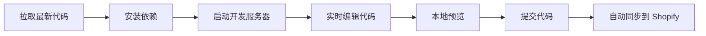
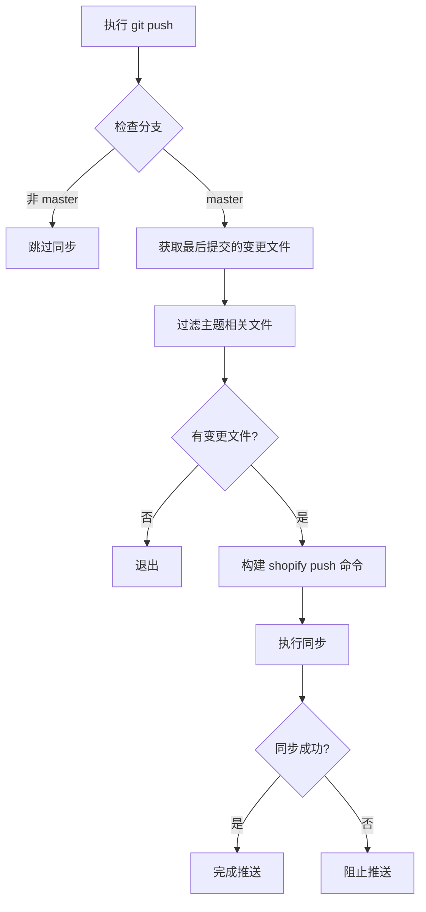
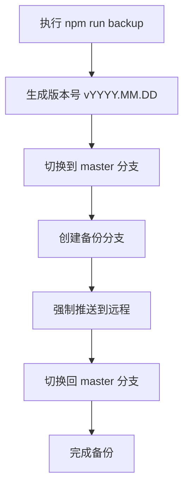

# Urtopia US Shopify Theme 开发者手册

## 目录

- [项目概述](#项目概述)
- [环境要求](#环境要求)
- [依赖项说明](#依赖项说明)
- [开发指南](#开发指南)
- [配置说明](#配置说明)
- [常用命令](#常用命令)
- [Git Hooks 行为说明](#git-hooks-行为说明)
- [代码备份策略](#代码备份策略)

---

## 项目概述

### 项目背景

Urtopia US 是一个基于 Shopify 平台的电动自行车电商网站主题项目。该项目为 Urtopia 品牌在美国市场的在线销售提供完整的电商解决方案，支持多语言、多产品展示、营销活动管理等功能。

### 主要功能

- **产品展示与管理**
  - 多产品系列展示（Carbon、Chord、Fusion 等系列）
  - 产品详情页配置
  - 产品对比功能
  - 配件展示与销售

- **营销活动管理**
  - 活动倒计时配置
  - 折扣价格管理
  - 促销横幅展示
  - 节日营销活动支持

- **多语言支持**
  - 支持 30+ 种语言（中文、英文、日文、韩文等）
  - 本地化内容管理

- **用户体验优化**
  - 响应式设计（移动端/桌面端）
  - 购物车抽屉/通知模式
  - 智能搜索功能
  - 社交媒体集成

### 技术架构

```
┌─────────────────────────────────────────┐
│           Shopify Platform              │
│  (Liquid Template Engine + API)         │
└─────────────────────────────────────────┘
                    ↓
┌─────────────────────────────────────────┐
│         Theme Architecture              │
│  ┌─────────┬─────────┬──────────────┐  │
│  │ Layouts │Sections │  Templates   │  │
│  └─────────┴─────────┴──────────────┘  │
│  ┌─────────┬─────────┬──────────────┐  │
│  │Snippets │ Assets  │   Locales    │  │
│  └─────────┴─────────┴──────────────┘  │
└─────────────────────────────────────────┘
                    ↓
┌─────────────────────────────────────────┐
│         Development Tools                │
│  • Tailwind CSS (样式框架)               │
│  • PostCSS (CSS 处理器)                  │
│  • Shopify CLI (命令行工具)              │
│  • Node.js (构建工具链)                  │
└─────────────────────────────────────────┘
```

### 适用场景

- Shopify 主题开发与定制
- 电商网站前端开发
- 多语言电商项目
- 响应式 Web 开发
- 营销活动页面快速搭建

---

## 环境要求

### 开发环境配置

#### 必需软件

| 软件 | 版本要求 | 说明 |
|------|----------|------|
| Node.js | 18.0+ | JavaScript 运行环境 |
| npm | 9.0+ | 包管理器（随 Node.js 安装） |
| Shopify CLI | 3.0+ | Shopify 命令行工具 |

#### 安装步骤

1. **安装 Node.js**
   ```bash
   # 访问 https://nodejs.org/ 下载并安装 LTS 版本
   node --version  # 验证安装
   npm --version   # 验证安装
   ```

2. **安装 Shopify CLI**
   ```bash
   npm install -g @shopify/cli
   shopify version  # 验证安装
   ```

3. **克隆项目**
   ```bash
   git clone https://github.com/ErpanOmer/urtopia-us.git
   cd urtopia-us
   npm install
   ```

### 操作系统兼容性

| 操作系统 | 支持状态 | 注意事项 |
|----------|----------|----------|
| Windows 10/11 | ✅ 完全支持 | 需使用 PowerShell 或 Git Bash |
| macOS 10.15+ | ✅ 完全支持 | 推荐使用 Homebrew 安装依赖 |
| Linux (Ubuntu/Debian) | ✅ 完全支持 | 需安装 Node.js 和 npm |

### 硬件推荐配置

| 配置项 | 最低要求 | 推荐配置 |
|--------|----------|----------|
| CPU | 双核 2.0GHz | 四核 2.5GHz+ |
| RAM | 4GB | 8GB+ |
| 存储 | 10GB 可用空间 | 20GB+ SSD |
| 网络 | 稳定连接 | 高速宽带（用于 Shopify 同步） |

---

## 依赖项说明

### 核心依赖清单

本项目采用纯开发依赖模式，无运行时核心依赖。

### 开发依赖清单

| 包名 | 版本 | 用途 |
|------|------|------|
| tailwindcss | ^3.4.17 | CSS 框架 |
| postcss | ^8.4.49 | CSS 转换工具 |
| autoprefixer | ^10.4.20 | CSS 自动添加浏览器前缀 |
| @tailwindcss/forms | ^0.5.10 | Tailwind 表单样式插件 |
| @tailwindcss/typography | ^0.5.16 | Tailwind 排版插件 |
| npm-run-all | ^4.1.5 | 并行/串行运行 npm 脚本 |

### 依赖安装方法

#### 标准安装

```bash
npm install
```

#### 使用淘宝镜像源（已配置）

项目已配置使用淘宝 npm 镜像源（`.npmrc`）：

```ini
registry=https://registry.npmmirror.com
```

如需切换回官方源：

```bash
npm config set registry https://registry.npmjs.org/
```

### 常见问题解决

#### 问题 1：安装速度慢

**解决方案**：使用淘宝镜像源（已默认配置）

#### 问题 2：权限错误（macOS/Linux）

**解决方案**：
```bash
sudo npm install
# 或使用 nvm 管理 Node.js 版本
```

#### 问题 3：依赖冲突

**解决方案**：
```bash
rm -rf node_modules package-lock.json
npm install
```

#### 问题 4：Tailwind CSS 编译失败

**解决方案**：
```bash
npm install -g tailwindcss
npx tailwindcss --version
```

---

## 开发指南

### 项目结构说明

```
urtopia-us/
├── assets/                    # 静态资源文件
│   ├── *.css                  # 样式文件
│   ├── *.js                   # JavaScript 文件
│   └── *.scss                 # SCSS 源文件
├── config/                    # 主题配置
│   ├── settings_data.json     # 主题设置数据
│   └── settings_schema.json   # 主题设置架构
├── layout/                    # 页面布局模板
│   ├── theme.liquid           # 主布局文件
│   ├── checkout.liquid        # 结账页面布局
│   └── password.liquid        # 密码页面布局
├── locales/                   # 多语言文件
│   ├── en.default.json        # 默认英文
│   ├── zh-CN.json             # 简体中文
│   └── ...                    # 其他 30+ 语言
├── sections/                  # 页面区块
│   ├── header.liquid          # 头部区块
│   ├── footer.liquid          # 底部区块
│   ├── main-product.liquid    # 产品详情区块
│   └── ...                    # 其他区块
├── snippets/                  # 可复用组件
│   ├── product-card.liquid    # 产品卡片组件
│   ├── icon-*.liquid          # 图标组件
│   └── ...                    # 其他组件
├── templates/                 # 页面模板
│   ├── index.json             # 首页模板
│   ├── product.json           # 产品页模板
│   ├── collection.json        # 分类页模板
│   └── ...                    # 其他页面模板
├── .git/                      # Git 仓库
│   └── hooks/
│       └── pre-push           # Git Hook 脚本
├── .gitignore                 # Git 忽略文件
├── .npmrc                     # npm 配置
├── .shopifyignore             # Shopify 忽略文件
├── backup.js                  # 备份脚本
├── config.yml                 # Shopify CLI 配置
├── package.json               # 项目配置与脚本
├── postcss.config.js          # PostCSS 配置
├── shopify-sync.js            # Shopify 同步脚本
├── tailwind.config.js         # Tailwind CSS 配置
└── tailwind.css               # Tailwind 入口文件
```

### 开发流程规范

#### 1. 本地开发流程



#### 2. 详细步骤

**步骤 1：拉取最新代码**
```bash
git checkout master
git pull origin master
```

**步骤 2：安装/更新依赖**
```bash
npm install
```

**步骤 3：启动开发服务器**
```bash
npm run dev
```

此命令会：
- 启动 Tailwind CSS 监听模式
- 启动 Shopify 主题监听模式
- 实时同步代码变更到 Shopify 后台

**步骤 4：编辑代码**
- 编辑 `sections/`、`snippets/`、`templates/` 等 Liquid 文件
- 编辑 `assets/` 中的 CSS/JS 文件
- 变更会自动同步到 Shopify

**步骤 5：提交代码**
```bash
git add .
git commit -m "描述变更内容"
git push origin master
```

**步骤 6：自动同步**
- Git pre-push hook 会自动同步变更的文件到 Shopify

#### 3. 发布流程

```bash
# 1. 确保所有变更已提交
git status

# 2. 在 Shopify 后台预览主题
# 访问 https://urtopia.myshopify.com/admin/themes

# 3. 确认无误后发布主题
shopify theme publish -s urtopia.myshopify.com
```

### 编码规范与风格要求

#### Liquid 模板规范

**命名规范**
- 文件名使用小写字母和连字符：`product-card.liquid`
- 变量名使用蛇形命名：`product_title`
- Section ID 使用 kebab-case：`product-section`

**代码格式**
```liquid
 注释说明 


  

  



  {{ item.title }}

```

**最佳实践**
- 使用 `` 而非 `` 以提高性能
- 避免在模板中编写复杂逻辑，使用 Schema 配置
- 使用 `settings` 对象存储可配置内容

#### CSS 规范

**Tailwind CSS 使用**
```liquid
<div class="flex items-center justify-between p-4 bg-white rounded-lg shadow-md">
  <h2 class="text-xl font-bold text-gray-900">标题</h2>
</div>
```

**自定义 CSS**
```css
/* 使用 er- 前缀避免冲突 */
.er-custom-component {
  /* 样式定义 */
}
```

**SCSS 规范**
```scss
// 使用嵌套结构
.product-card {
  &__title {
    font-size: 1.5rem;
  }

  &__price {
    color: #FD4B17;
  }
}
```

#### JavaScript 规范

**使用现代 ES6+ 语法**
```javascript
const elements = document.querySelectorAll('.product-card');

elements.forEach(element => {
  element.addEventListener('click', (event) => {
    console.log('Clicked:', event.target);
  });
});
```

**事件委托**
```javascript
document.addEventListener('click', (event) => {
  if (event.target.matches('.button-class')) {
    // 处理点击事件
  }
});
```

### 分支管理策略

#### 分支结构

```
master (主分支)
  ├── v2023.10.30 (备份分支)
  ├── v2023.11.02 (备份分支)
  ├── v2024.01.05 (备份分支)
  └── v2026.01.22 (备份分支)
```

#### 分支命名规范

- **master**: 主分支，用于日常开发
- **vYYYY.MM.DD**: 版本备份分支，格式为日期

#### 分支操作流程

**创建备份分支**
```bash
npm run backup
# 或手动执行
git checkout master
git checkout -B v2026.01.22
git push origin v2026.01.22 -f
git checkout master
```

**切换分支**
```bash
git checkout v2026.01.22
```

**合并分支**
```bash
git checkout master
git merge v2026.01.22
```

#### 分支保护规则

- `master` 分支受保护，禁止直接推送
- 所有变更必须通过 Pull Request（如配置）
- pre-push hook 只在 `master` 分支执行 Shopify 同步

---

## 配置说明

### 配置文件详解

#### config.yml - Shopify CLI 配置

```yaml
development:
  password: shptka_dab499d4c49564633f7e939fd532c667
  theme_id: "133930189048"
  store: urtopia.myshopify.com
```

**配置项说明**
- `password`: Shopify API 密钥（用于身份验证）
- `theme_id`: 开发主题 ID
- `store`: Shopify 商店域名

**多环境配置**
```yaml
development:
  password: ${SHOPIFY_DEV_PASSWORD}
  theme_id: "133930189048"
  store: urtopia-dev.myshopify.com

staging:
  password: ${SHOPIFY_STAGING_PASSWORD}
  theme_id: "133930189049"
  store: urtopia-staging.myshopify.com

production:
  password: ${SHOPIFY_PROD_PASSWORD}
  theme_id: "133930189050"
  store: urtopia.myshopify.com
```

#### tailwind.config.js - Tailwind CSS 配置

```javascript
export default {
  content: [
    './layout/*.liquid',
    './sections/*.liquid',
    './snippets/*.liquid',
    './templates/*.liquid'
  ],
  prefix: 'er-',                    // 类名前缀，避免冲突
  corePlugins: {
    preflight: false,                // 禁用 Preflight，避免重置 Shopify 样式
  },
  theme: {
    extend: {
      screens: {
        mb: { max: '768px' },        // 移动端断点
        headermb: { max: '989px' }    // 头部移动端断点
      },
      fontFamily: {
        base: ['Inter', 'sans-serif'] // 字体配置
      },
      colors: {
        primary: '#FD4B17',           // 主色调
        dark: '#242729',
        gray: '#A0A1A2',
        secondary: '#E2542E',
        background: '#F7F8FA',
        salecolor: '#D50B28'          // 促销色
      }
    }
  },
  plugins: [
    typography                       // 排版插件
  ]
}
```

**自定义断点**
```javascript
screens: {
  'xs': '480px',
  'sm': '640px',
  'md': '768px',
  'lg': '1024px',
  'xl': '1280px',
  '2xl': '1536px'
}
```

#### postcss.config.js - PostCSS 配置

```javascript
export default {
  plugins: {
    tailwindcss: {},      // Tailwind CSS 处理
    autoprefixer: {}      // 自动添加浏览器前缀
  }
}
```

### 环境变量说明

#### Shopify API 密钥

**获取方式**
1. 访问 Shopify 后台
2. 进入 Apps → Manage private apps
3. 创建私有应用并获取 API 密钥

**配置位置**
- `config.yml` 中的 `password` 字段
- `package.json` 脚本中的 `--password` 参数

**安全建议**
- 不要将 API 密钥提交到 Git（已添加到 `.gitignore`）
- 使用环境变量存储敏感信息
- 定期轮换 API 密钥

### 不同环境配置差异

#### 开发环境

**特点**
- 实时同步代码变更
- 使用开发主题 ID
- 启用调试模式

**配置**
```yaml
development:
  password: shptka_dab499d4c49564633f7e939fd532c667
  theme_id: "133930189048"
  store: urtopia.myshopify.com
```

**启动命令**
```bash
npm run dev
```

#### 测试环境

**特点**
- 使用独立测试主题
- 禁用实时同步
- 用于 QA 测试

**配置**
```yaml
staging:
  password: ${SHOPIFY_STAGING_PASSWORD}
  theme_id: "133930189049"
  store: urtopia-staging.myshopify.com
```

**启动命令**
```bash
shopify theme dev --store urtopia-staging.myshopify.com --theme 133930189049
```

#### 生产环境

**特点**
- 使用生产主题 ID
- 手动发布流程
- 启用性能优化

**配置**
```yaml
production:
  password: ${SHOPIFY_PROD_PASSWORD}
  theme_id: "133930189050"
  store: urtopia.myshopify.com
```

**发布命令**
```bash
shopify theme publish -s urtopia.myshopify.com
```

### 自定义配置方法

#### 主题自定义设置

通过 `config/settings_schema.json` 配置主题自定义选项：

**全局变量配置**
```json
{
  "name": "global_variable",
  "settings": [
    {
      "type": "text",
      "id": "sale_name",
      "label": "活动名称",
      "default": "Independence Day Sale"
    },
    {
      "type": "text",
      "id": "shop_count",
      "label": "店铺数量",
      "default": "700+"
    },
    {
      "type": "checkbox",
      "id": "hide_sale_countdown",
      "default": false,
      "label": "是否隐藏活动倒计时"
    }
  ]
}
```

**颜色配置**
```json
{
  "name": "colors",
  "settings": [
    {
      "type": "color",
      "id": "colors_accent_1",
      "default": "#121212",
      "label": "主色调"
    },
    {
      "type": "color_background",
      "id": "gradient_accent_1",
      "label": "渐变背景"
    }
  ]
}
```

**字体配置**
```json
{
  "name": "typography",
  "settings": [
    {
      "type": "font_picker",
      "id": "type_header_font",
      "default": "assistant_n4",
      "label": "标题字体"
    },
    {
      "type": "range",
      "id": "heading_scale",
      "min": 100,
      "max": 150,
      "step": 5,
      "unit": "%",
      "label": "标题缩放",
      "default": 100
    }
  ]
}
```

#### 使用自定义配置

在 Liquid 模板中访问配置：

```liquid
{{ settings.sale_name }}
{{ settings.shop_count }}


  <!-- 显示倒计时 -->


<div style="color: {{ settings.colors_accent_1 }}">
  内容
</div>
```

#### 添加新的自定义选项

1. 编辑 `config/settings_schema.json`
2. 添加新的配置项
3. 在 Liquid 模板中使用 `settings.*` 访问
4. 在 Shopify 后台主题编辑器中配置

---

## 常用命令

### 开发相关命令

#### 启动开发服务器

```bash
npm run dev
```

**功能**
- 启动 Tailwind CSS 监听模式（自动编译）
- 启动 Shopify 主题监听模式（实时同步）
- 所有代码变更会自动同步到 Shopify 后台

**输出示例**
```
[watch-css] Watching...
[theme-dev] Watching for changes...
```

#### 编译 Tailwind CSS

```bash
npm run css
```

**功能**
- 编译 Tailwind CSS 为压缩版本
- 输出到 `assets/tailwind.min.css`

**监听模式**
```bash
npm run watch-css
```

#### 拉取线上最新版本

```bash
npm run pull
```

**功能**
- 从 Shopify 拉取 Live 版本主题
- 覆盖本地文件

**注意事项**
- 会覆盖本地未提交的变更
- 建议先提交本地变更

#### 列出所有主题

```bash
npm run list
```

**功能**
- 列出 Shopify 商店中的所有主题
- 显示主题 ID 和名称

### 测试相关命令

**注意**：本项目未配置自动化测试框架。

#### 手动测试流程

1. **本地预览**
   ```bash
   npm run dev
   # 访问 Shopify 后台预览开发主题
   ```

2. **跨浏览器测试**
   - Chrome/Edge（最新版）
   - Firefox（最新版）
   - Safari（最新版）
   - 移动端浏览器

3. **响应式测试**
   - 桌面端（1920x1080）
   - 平板端（768x1024）
   - 移动端（375x667）

### 部署相关命令

#### 推送到 Git

```bash
npm run push
```

**功能**
- 强制推送到远程仓库
- 触发 pre-push hook（自动同步到 Shopify）

**注意事项**
- 使用 `-f` 强制推送
- 仅用于 master 分支

#### 创建新主题

```bash
shopify theme push --unpublished -s urtopia.myshopify.com -t "新主题名称"
```

**功能**
- 基于当前代码创建新主题
- 主题状态为未发布

#### 发布主题

```bash
shopify theme publish -s urtopia.myshopify.com
```

**功能**
- 将开发主题发布为 Live 主题
- 替换当前线上主题

**注意事项**
- ⚠️ 此操作会直接发布到生产环境
- 请确保已充分测试

#### 同步特定文件

```bash
npm run shopify:sync
```

**功能**
- 同步最后提交的变更文件到 Shopify
- 自动过滤非主题文件

**执行逻辑**
1. 检查当前分支（仅 master）
2. 获取最后提交的变更文件
3. 过滤主题相关文件
4. 执行 `shopify theme push --only`

### 代码质量检查命令

**注意**：本项目未配置 ESLint、Prettier 等代码质量工具。

#### 手动代码审查

1. **Liquid 语法检查**
   - 使用 Shopify 主题编辑器验证
   - 检查 Liquid 标签闭合

2. **CSS 验证**
   - 使用浏览器开发者工具
   - 检查 Tailwind 类名正确性

3. **JavaScript 检查**
   - 使用浏览器控制台
   - 检查语法错误和运行时错误

#### 添加代码质量工具（可选）

如需添加代码质量检查，可安装以下工具：

```bash
npm install --save-dev eslint prettier eslint-plugin-liquid
```

配置 `.eslintrc.js`：
```javascript
module.exports = {
  env: {
    browser: true,
    es2021: true
  },
  extends: 'eslint:recommended',
  parserOptions: {
    ecmaVersion: 'latest',
    sourceType: 'module'
  },
  rules: {
    'no-unused-vars': 'warn',
    'no-console': 'off'
  }
}
```

添加到 `package.json`：
```json
{
  "scripts": {
    "lint": "eslint assets/**/*.js",
    "format": "prettier --write \"**/*.{js,css,liquid}\""
  }
}
```

---

## Git Hooks 行为说明

### 已配置的 Hooks 类型

#### pre-push Hook

**文件位置**：`.git/hooks/pre-push`

**触发时机**：执行 `git push` 命令时

**功能**：自动同步最后提交的 Shopify 主题文件到线上

### 各 Hook 的具体功能与执行逻辑

#### pre-push Hook 详细说明

**执行流程**



**脚本逻辑**

```bash
#!/bin/sh
set -e

echo "🚀 Pre-push: Shopify theme sync (Last Commit Only)"

# 配置
STORE="urtopia.myshopify.com"
THEME_ID="133930189048"
SYNC_DIRS="sections templates snippets assets config locales"

# 1. 检查分支
BRANCH=$(git branch --show-current)
if [ "$BRANCH" != "master" ]; then
  echo "⛔ Refuse Shopify sync on branch: $BRANCH"
  exit 0  # 非 master 分支跳过同步
fi

# 2. 获取最后提交的变更文件
CHANGED_FILES=$(git diff-tree --no-commit-id --name-only -r HEAD)

# 3. 过滤主题文件
FILES_TO_PUSH=""
for file in $CHANGED_FILES; do
  for dir in $SYNC_DIRS; do
    case "$file" in
      $dir/*)
        FILES_TO_PUSH="$FILES_TO_PUSH $file"
        ;;
    esac
  done
done

# 4. 去重
FILES_TO_PUSH=$(echo "$FILES_TO_PUSH" | tr ' ' '\n' | sort -u)

# 5. 检查是否有变更
if [ -z "$FILES_TO_PUSH" ]; then
  echo "ℹ️ No Shopify theme files changed in the last commit."
  exit 0
fi

# 6. 执行同步
CMD="shopify theme push --store \"$STORE\" --theme \"$THEME_ID\" --allow-live"
for f in $FILES_TO_PUSH; do
  CMD="$CMD --only \"$f\""
done

echo "🚀 Uploading to Shopify..."
eval $CMD

echo "✅ Shopify theme sync completed"
exit 0
```

**配置项说明**

| 配置项 | 值 | 说明 |
|--------|-----|------|
| `STORE` | urtopia.myshopify.com | Shopify 商店域名 |
| `THEME_ID` | 133930189048 | 开发主题 ID |
| `SYNC_DIRS` | sections templates snippets assets config locales | 需要同步的目录 |

**过滤规则**

只同步以下目录中的文件：
- `sections/` - 页面区块
- `templates/` - 页面模板
- `snippets/` - 可复用组件
- `assets/` - 静态资源
- `config/` - 配置文件
- `locales/` - 多语言文件

**不同步的文件**
- `package.json`、`package-lock.json`
- `*.config.js` 配置文件
- `*.js` 脚本文件（backup.js、shopify-sync.js）
- `README.md` 等文档文件

### 自定义 Hook 的方法

#### 修改现有 Hook

1. 编辑 `.git/hooks/pre-push`
2. 修改配置或逻辑
3. 保存文件（确保可执行权限）

**示例：修改同步目录**

```bash
# 添加新的同步目录
SYNC_DIRS="sections templates snippets assets config locales layouts"
```

**示例：禁用分支检查**

```bash
# 注释掉分支检查代码
# BRANCH=$(git branch --show-current)
# if [ "$BRANCH" != "master" ]; then
#   echo "⛔ Refuse Shopify sync on branch: $BRANCH"
#   exit 0
# fi
```

#### 添加新的 Hook

**pre-commit Hook**（提交前检查）

创建 `.git/hooks/pre-commit`：
```bash
#!/bin/sh

echo "🔍 Running pre-commit checks..."

# 检查 Liquid 语法
if git diff --cached --name-only | grep -q '\.liquid$'; then
  echo "✓ Liquid files detected"
fi

# 检查 JS 语法
if git diff --cached --name-only | grep -q '\.js$'; then
  echo "✓ JavaScript files detected"
fi

echo "✅ Pre-commit checks passed"
exit 0
```

**commit-msg Hook**（提交信息格式检查）

创建 `.git/hooks/commit-msg`：
```bash
#!/bin/sh

COMMIT_MSG_FILE=$1
COMMIT_MSG=$(cat "$COMMIT_MSG_FILE")

# 检查提交信息长度
if [ ${#COMMIT_MSG} -lt 10 ]; then
  echo "❌ Commit message too short (minimum 10 characters)"
  exit 1
fi

# 检查是否包含任务编号（可选）
if ! echo "$COMMIT_MSG" | grep -qE "^(feat|fix|docs|style|refactor|test|chore)"; then
  echo "⚠️ Consider using conventional commit format"
  echo "   feat: add new feature"
  echo "   fix: fix bug"
  echo "   docs: update documentation"
fi

exit 0
```

#### Hook 脚本最佳实践

1. **添加执行权限**
   ```bash
   chmod +x .git/hooks/pre-commit
   chmod +x .git/hooks/pre-push
   ```

2. **使用 shebang**
   ```bash
   #!/bin/sh
   # 或
   #!/bin/bash
   ```

3. **错误处理**
   ```bash
   set -e  # 遇到错误立即退出
   ```

4. **清晰的输出**
   ```bash
   echo "✅ Success"
   echo "❌ Error"
   echo "ℹ️ Info"
   echo "⚠️ Warning"
   ```

5. **退出码**
   - `exit 0` - 成功，允许操作继续
   - `exit 1` - 失败，阻止操作

---

## 代码备份策略

### 备份脚本说明

**脚本文件**：`backup.js`

**功能**：自动创建版本备份分支并推送到远程仓库

### 备份执行流程



### 备份脚本详细逻辑

```javascript
import { exec } from 'node:child_process'

// 生成版本号
const now = new Date()
const year = `${now.getFullYear()}`
const month = (`${now.getMonth() + 1}`).padStart(2, '0')
const day = (`${now.getDate()}`).padStart(2, '0')
const version = `v${year}.${month}.${day}`

// 执行命令
await run(`git checkout master`)
await run(`git checkout -B ${version}`)
await run(`git push origin ${version} -f`)
await run(`git checkout master`)
```

**版本号格式**：`vYYYY.MM.DD`

**示例**：
- `v2026.01.22`
- `v2026.01.23`
- `v2026.01.24`

### 备份命令

#### 创建备份

```bash
npm run backup
```

**输出示例**
```
step:1 -------> git checkout master
step:2 -------> git checkout -B v2026.01.22
step:3 -------> git push origin v2026.01.22 -f
step:4 -------> git checkout master
```

#### 手动创建备份

```bash
# 1. 切换到 master
git checkout master

# 2. 创建备份分支
git checkout -B v2026.01.22

# 3. 推送到远程
git push origin v2026.01.22 -f

# 4. 切回 master
git checkout master
```

### 备份恢复流程

#### 从备份分支恢复

```bash
# 1. 切换到备份分支
git checkout v2026.01.22

# 2. 查看历史
git log

# 3. 如需恢复到 master
git checkout master
git merge v2026.01.22
```

#### 查看所有备份分支

```bash
git branch -a | grep v
```

**输出示例**
```
  v2023.10.30
  v2023.11.02
  v2024.01.05
  v2026.01.22
```

### 备份策略建议

#### 备份频率

| 场景 | 备份频率 | 说明 |
|------|----------|------|
| 日常开发 | 每日一次 | 工作日结束前 |
| 重要变更 | 立即备份 | 发布前、重大功能上线前 |
| 版本发布 | 强制备份 | 每次发布前创建备份 |

#### 备份命名规范

**标准格式**：`vYYYY.MM.DD`

**特殊格式**（可选）：
- `vYYYY.MM.DD-feature` - 功能备份
- `vYYYY.MM.DD-hotfix` - 热修复备份
- `vYYYY.MM.DD-release` - 发布备份

#### 备份保留策略

| 备份类型 | 保留期限 | 说明 |
|----------|----------|------|
| 每日备份 | 30 天 | 保留最近 30 天的每日备份 |
| 每周备份 | 3 个月 | 每周日的备份保留 3 个月 |
| 发布备份 | 永久保留 | 每次发布的备份永久保留 |
| 特殊备份 | 按需保留 | 重要功能备份按需保留 |

#### 自动化备份（可选）

**使用 GitHub Actions**

创建 `.github/workflows/backup.yml`：
```yaml
name: Daily Backup

on:
  schedule:
    - cron: '0 18 * * 1-5'  # 工作日 18:00

jobs:
  backup:
    runs-on: ubuntu-latest
    steps:
      - uses: actions/checkout@v3
        with:
          fetch-depth: 0

      - name: Create backup branch
        run: |
          VERSION="v$(date +%Y.%m.%d)"
          git checkout master
          git checkout -B $VERSION
          git push origin $VERSION -f
          git checkout master
```

### 备份与 Git Hooks 集成

**在 pre-push hook 中添加备份提示**

编辑 `.git/hooks/pre-push`：
```bash
#!/bin/sh
set -e

# 检查是否需要备份
LAST_BACKUP=$(git branch -a | grep -E "v[0-9]{4}\.[0-9]{2}\.[0-9]{2}" | tail -1 | awk '{print $1}')
LAST_BACKUP_DATE=$(echo $LAST_BACKUP | sed 's/v//' | tr '.' '-')

TODAY=$(date +%Y-%m-%d)
YESTERDAY=$(date -d "yesterday" +%Y-%m-%d)

if [ "$LAST_BACKUP_DATE" != "$TODAY" ] && [ "$LAST_BACKUP_DATE" != "$YESTERDAY" ]; then
  echo "⚠️ Last backup was on $LAST_BACKUP_DATE"
  echo "💡 Consider running: npm run backup"
fi

# 继续执行原有逻辑...
```

### 备份验证

#### 验证备份完整性

```bash
# 1. 切换到备份分支
git checkout v2026.01.22

# 2. 检查文件完整性
git status

# 3. 验证关键文件
ls -la assets/
ls -la sections/
ls -la templates/

# 4. 切回 master
git checkout master
```

#### 验证备份可用性

```bash
# 1. 创建测试分支
git checkout -b test-restore

# 2. 合并备份分支
git merge v2026.01.22

# 3. 解决冲突（如有）
# 4. 测试功能
# 5. 删除测试分支
git checkout master
git branch -D test-restore
```

---

## 附录

### 常见问题 FAQ

#### Q1: 如何重置开发环境？

```bash
# 1. 删除 node_modules
rm -rf node_modules

# 2. 删除 package-lock.json
rm package-lock.json

# 3. 重新安装依赖
npm install

# 4. 拉取最新代码
git pull origin master
```

#### Q2: 如何解决 Shopify 同步失败？

```bash
# 1. 检查网络连接
ping urtopia.myshopify.com

# 2. 验证 API 密钥
shopify theme list --store urtopia.myshopify.com

# 3. 手动同步
shopify theme push --store urtopia.myshopify.com --theme 133930189048 --allow-live
```

#### Q3: 如何回滚到之前的版本？

```bash
# 1. 查看提交历史
git log --oneline

# 2. 回滚到指定提交
git reset --hard <commit-hash>

# 3. 强制推送（谨慎使用）
git push origin master -f
```

#### Q4: 如何添加新的语言支持？

1. 在 `locales/` 目录创建新的语言文件
2. 复制 `en.default.json` 作为模板
3. 翻译内容
4. 在 Shopify 后台启用新语言

#### Q5: 如何优化主题性能？

1. 压缩图片资源
2. 使用懒加载
3. 减少 JavaScript 文件大小
4. 启用 Shopify 性能优化
5. 使用 CDN 加速静态资源

### 相关资源

#### 官方文档

- [Shopify CLI 文档](https://shopify.dev/docs/themes/tools/cli/commands)
- [Liquid 模板文档](https://shopify.dev/docs/api/liquid)
- [Tailwind CSS 文档](https://tailwindcss.com/docs)
- [Shopify 主题开发文档](https://shopify.dev/docs/themes)

#### 社区资源

- [Shopify 论坛](https://community.shopify.com/)
- [Liquid 教程](https://liquid.bootcss.com/)
- [Tailwind CSS 组件库](https://tailwindui.com/)

### 联系方式

- **项目仓库**: https://github.com/ErpanOmer/urtopia-us
- **问题反馈**: https://github.com/ErpanOmer/urtopia-us/issues
- **作者**: ErpanOmer

### 更新日志

#### v1.0.0 (2026-01-22)
- 初始版本
- 完整的开发者文档
- Git Hooks 配置
- 备份策略实现

---

**文档版本**: 1.0.0
**最后更新**: 2026-01-22
**维护者**: ErpanOmer
